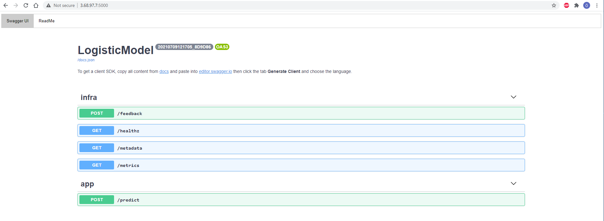

# BentoML Model Api Dockerization

A sample project including dockerization of ml models api's using bentoml framework

## Step 1 - Installing BentoML

**Note:** Ubuntu 20.04 OS is used in this project. The Installation process can be different for other operating systems.

* [x] Open your bash shell and run the command below.

```text
pip install bentoml
```

1. [x] After installing bentoml. Close your session and reconnect to the VM.
2. [x] Check the version to be sure it's installed.

```text
bentoml --version
```

Desired output:

```text
bentoml, version x.x.x
```

## Step 2 - Creating Model API py

* [x] Open your jupyter notebook.

```text
jupyter notebook
```

* [x] Create and dump dummy ML model \([https://machinelearningmastery.com/save-load-machine-learning-models-python-scikit-learn/](https://machinelearningmastery.com/save-load-machine-learning-models-python-scikit-learn/)\)

```text
# Save Model Using Pickle
import pandas
from sklearn import model_selection
from sklearn.linear_model import LogisticRegression
import pickle
url = "https://raw.githubusercontent.com/jbrownlee/Datasets/master/pima-indians-diabetes.data.csv"
names = ['preg', 'plas', 'pres', 'skin', 'test', 'mass', 'pedi', 'age', 'class']
dataframe = pandas.read_csv(url, names=names)
array = dataframe.values
X = array[:,0:8]
Y = array[:,8]
test_size = 0.33
seed = 7
X_train, X_test, Y_train, Y_test = model_selection.train_test_split(X, Y, test_size=test_size, random_state=seed)
# Fit the model on training set
model = LogisticRegression()
model.fit(X_train, Y_train)
# save the model to disk
filename = 'finalized_model.sav'
pickle.dump(model, open(filename, 'wb'))
```

* [x] Create model\_service.py over jupyter notebook

```text
%%writefile logistic_model_service.py
import pandas as pd
from bentoml import env, artifacts, api, BentoService
from bentoml.adapters import DataframeInput
from bentoml.service.artifacts.common import PickleArtifact

@env(infer_pip_packages=True)
@artifacts([PickleArtifact('model')])
class LogisticModel(BentoService):
    """
    A minimum prediction service exposing a Scikit-learn model
    """

    @api(input=DataframeInput(), batch=True)
    def predict(self, df: pd.DataFrame):
        """
        An inference API named `predict` with Dataframe input adapter, which codifies
        how HTTP requests or CSV files are converted to a pandas Dataframe object as the
        inference API function input
        """
        return self.artifacts.model.predict(df)
```

## Step 3 - Save Prediction Service with Model

```text
# bento_packer.py

#import pickle to load dumped model
import pickle

# import the LogisticModel class defined above
from logistic_model_service import LogisticModel


# import dumped model
filename = 'finalized_model.sav'
loaded_model = pickle.load(open(filename, 'rb'))


# Create a logistic model service instance
logistic_model_service = LogisticModel()

# Pack the newly trained model artifact
logistic_model_service .pack('model', loaded_model )

# Save the prediction service to disk for model serving
saved_path = logistic_model_service .save()
```

* [x] The output should be similar to the text shown below.

```text
[2021-07-09 11:25:33,142] INFO - BentoService bundle 'LogisticModel:20210709112532_463C04' saved to: /home/ubuntu/bentoml/repository/LogisticModel/20210709112532_463C04
```

## Step 4 - Serve Your Model 

* [x] Run this command on your jupyter notebook.

```text
!bentoml serve LogisticModel:latest --port 5000
```

* [x] Leave this notebook open and create a different notebook file to test your API

```text
import requests

test_data=[[3, 102, 44, 20, 94, 30.8, 0.4, 26 ]]
response = requests.post("http://localhost:5000/predict", json=test_data)
print(response.text)
```

* [x] The response should be like ,

```text
[0.0]
```

* [x] If you get the same result it means that your API is working correctly. You can stop your notebooks and jump to the next step to dockerize yourAPI.

## Step 5 - Dockerization

Note: To complete this step successfully, you need to have docker installed on your server !! To learn how to install docker on ubuntu, you can visit this website \([https://docs.docker.com/engine/install/ubuntu/](https://docs.docker.com/engine/install/ubuntu/)\). If you install docker after you install bentoML, you may need to uninstall and install bentoML again.

* [x] On your bash, run the following command

```text
docker run -p 5000:5000 logistic-model:latest --workers=1 --enable-microbatch
```

* [x] The output should be like,

```text
ubuntu@ip-172-31-5-143:~$ docker run -p 5000:5000 logistic-model:latest --workers=1 --enable-microbatch
[2021-07-09 12:53:23,604] WARNING - Option --enable-microbatch/--disable-microbatch has been deprecated in the current release. The micro-batching option has become the default. Consider using --mb-max-batching=1 to simulate the effect of --disable-microbatch
[2021-07-09 12:53:23,608] INFO - Starting BentoML proxy in production mode..
[2021-07-09 12:53:23,609] INFO - Starting BentoML API server in production mode..
[2021-07-09 12:53:23,622] INFO - Running micro batch service on :5000
[2021-07-09 12:53:23 +0000] [9] [INFO] Starting gunicorn 20.1.0
[2021-07-09 12:53:23 +0000] [9] [INFO] Listening at: http://0.0.0.0:40507 (9)
[2021-07-09 12:53:23 +0000] [9] [INFO] Using worker: sync
[2021-07-09 12:53:23 +0000] [10] [INFO] Booting worker with pid: 10
[2021-07-09 12:53:23 +0000] [1] [INFO] Starting gunicorn 20.1.0
[2021-07-09 12:53:23 +0000] [1] [INFO] Listening at: http://0.0.0.0:5000 (1)
[2021-07-09 12:53:23 +0000] [1] [INFO] Using worker: aiohttp.worker.GunicornWebWorker
[2021-07-09 12:53:23 +0000] [11] [INFO] Booting worker with pid: 11
[2021-07-09 12:53:23,803] INFO - Micro batch enabled for API `predict` max-latency: 20000 max-batch-size 4000
[2021-07-09 12:53:23,803] INFO - Your system nofile limit is 1048576, which means each instance of microbatch service is able to hold this number of connections at same time. You can increase the number of file descriptors for the server process, or launch more microbatch instances to accept more concurrent connection.
```

* [x] Test your dockerized api using jupyter notebook,

```text
import requests

test_data=[[3, 102, 44, 20, 94, 30.8, 0.4, 26 ]]
response = requests.post("http://localhost:5000/predict", json=test_data)
print(response.text)
```

* [x] The output should be like,

```text
[0.0]
```

* [x] You can now reach the UI using your host IP adaress and dedicated port. You can run some tests using this UI.



## Hint:

If you want to use your docker image in another host, you can save your image as a tar file. 

```text
sudo docker save -o /home/sammy/your_image.tar your_image_name
```

After uploading this tar file to another host you can simply load this image with the following command

```text
sudo docker load -i your_image.tar
```


## Conclusion

Congratulation! You dockerized your ml model using bentoML. You can use this image on any host that has docker. In addition, you can reach the bentoML API UI over IP address and dedicated port.


